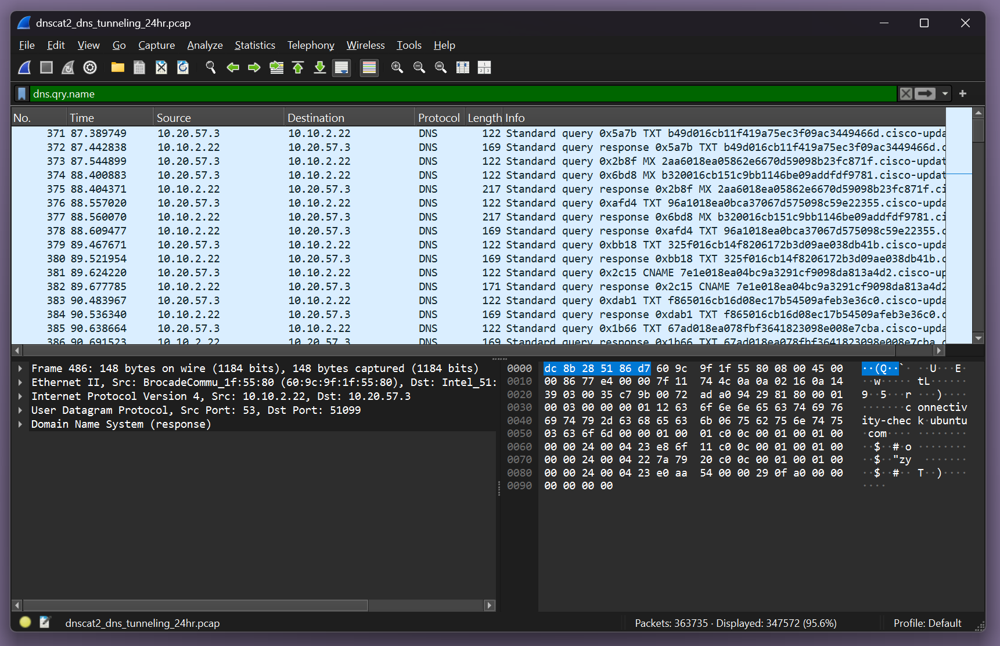
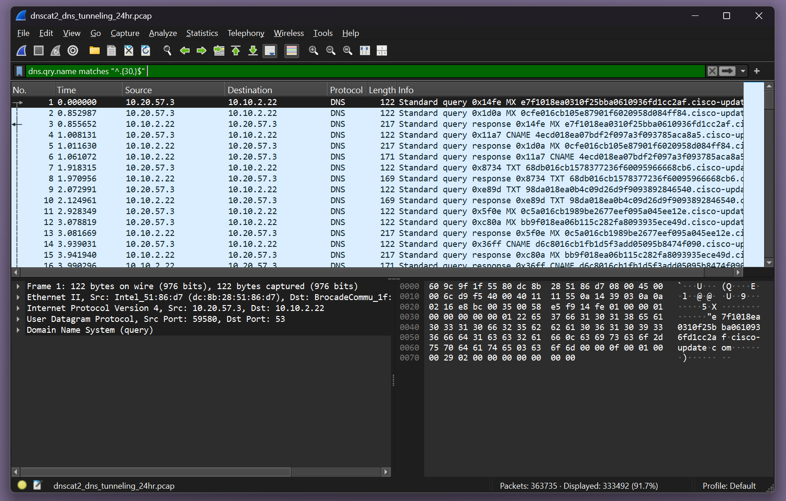
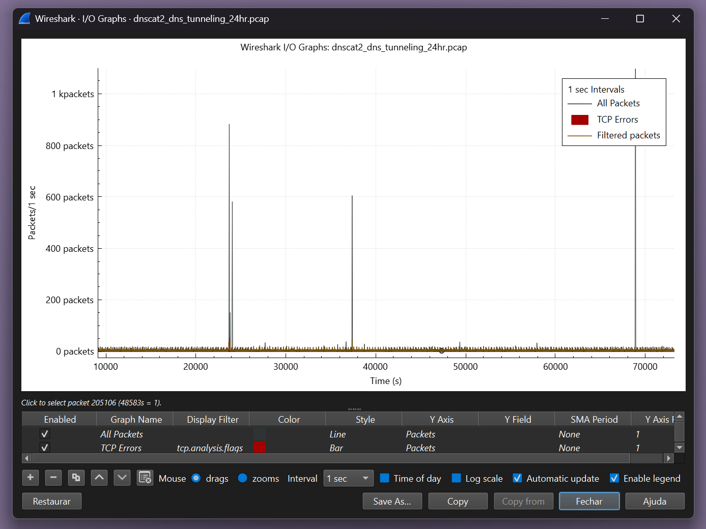
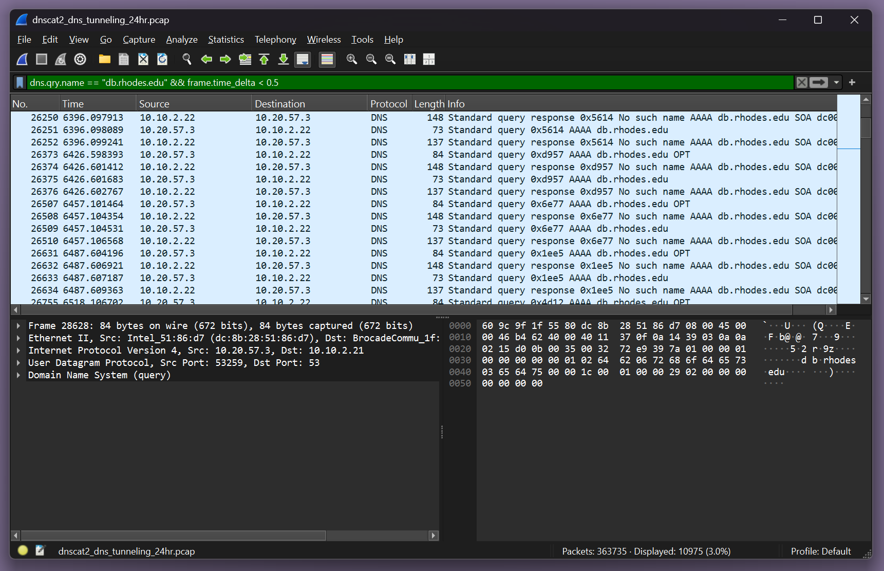

# 🛰️ Detecção de Beaconing via DNS com Wireshark

[]()
[]()
[]()

## 📦 dns-tunneling-detection/

```
├── images/                                 <- Capturas de tela da análise
│   ├── 01_dns_qry_name_filter.png
│   ├── 02_dns_qry_name_long_domains_filter.png
│   ├── 03_packet_graph.png
│   └── 04_repeated_dns_requests_sequence.png
├── pcap/                                  <- Arquivo analisado
│   └── dnscat2_dns_tunneling_24hr.pcap
└── README.md                               <- Este arquivo
```

## 🧠 Objetivo
O objetivo deste projeto é identificar indicadores de comunicação C2 (Command and Control) através do protocolo DNS, como parte de um possível cenário de beaconing malicioso. Detectar esse tipo de atividade é essencial em ambientes SOC (Security Operations Center), já que ataques avançados frequentemente utilizam o DNS para se comunicar de forma furtiva com servidores remotos.

---

## 🔍 Contexto
Analisamos uma captura de tráfego `.pcap` usando Wireshark, focando em padrões de requisições DNS que podem indicar:

- Comunicação com domínios gerados automaticamente (DGA).
- Exfiltração de dados via subdomínios codificados.
- Atividade de beaconing com intervalos fixos e repetitivos.

O objetivo foi identificar se há sinais de malware tentando manter comunicação com um servidor remoto, indicando um possível ataque de DNS Tunneling.

---

## 📸 Evidências da Análise

### 🖼️ 1. Filtro por Nome de Domínio (`dns.qry.name`)


- A análise foca em requisições DNS para domínios com padrões anômalos: subdomínios longos, aleatórios ou codificados.
- Pode indicar o uso de domínios DGA ou canais C2 que utilizam DNS.
- Alguns domínios eram completamente desconhecidos e obscuros, sem associação com serviços legítimos.

---

### 🖼️ 2. Filtro para Domínios Longos


- Destacamos domínios com nomes longos e múltiplos subdomínios codificados.
- Esse é um forte indício de exfiltração via DNS ou técnicas de tunelamento.
- Associado à TTP:  
  `T1071.004 – Application Layer Protocol: DNS`

---

### 🖼️ 3. Gráfico de Pacotes ao Longo do Tempo


- O gráfico mostra padrões regulares de envio de pacotes DNS.
- Intervalos temporais consistentes entre os pacotes são comuns em beaconing.
- A comunicação periódica pode indicar malware aguardando instruções de um servidor C2 remoto.

---

### 🖼️ 4. Requisições DNS Repetidas em Sequência


- Observamos requisições repetidas para os mesmos domínios suspeitos.
- Quando o padrão é constante e o domínio é anômalo, isso reforça o comportamento malicioso.
- Pode representar:
  - Polling por comandos.
  - Exfiltração fragmentada de dados.

---

## ✅ Conclusão
A análise sugere fortemente a presença de beaconing via DNS, com base nos seguintes pontos:

- Consultas para domínios longos, obscuros e com subdomínios aleatórios.
- Frequência regular de requisições, característica de beaconing.
- Requisições DNS repetidas para os mesmos domínios, sem interação humana real.

📌 Um analista de SOC deve estar atento a esse padrão, pois ele é frequentemente ignorado por soluções tradicionais de detecção. A resposta pode envolver:

- Enriquecimento com Threat Intelligence.
- Isolamento do host envolvido.
- Criação de regras de alerta no SIEM com base na frequência de DNS, tamanho de domínio e domínios não resolvidos.

---

## 🧰 Ferramentas Usadas
- 🐍 **Wireshark**  
- 📄 Arquivo PCAP: `dnscat2_dns_tunneling_24hr.pcap` (simulado)  
- 🔬 Análise Temporal e Filtros (`dns.qry.name`, gráficos de pacotes)
