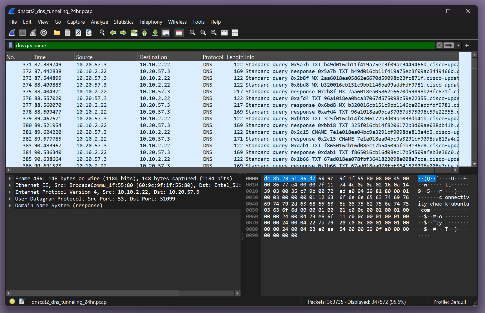
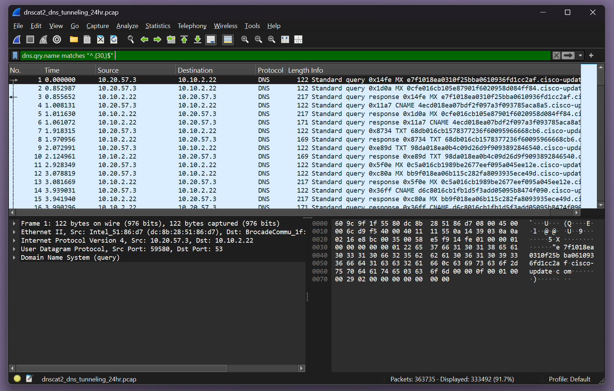
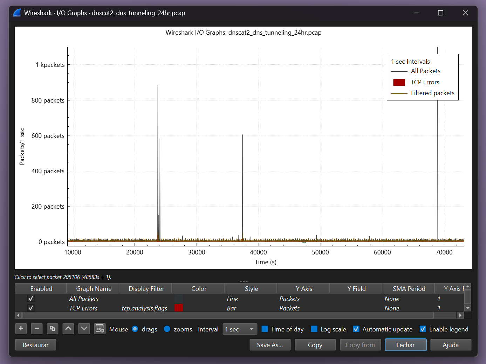
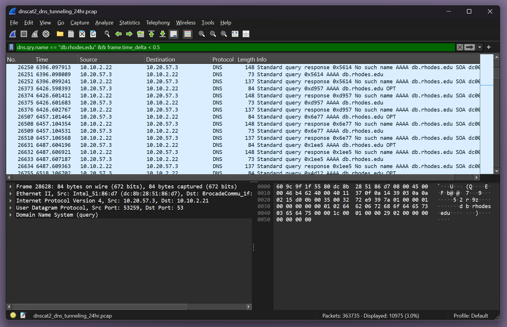

# 🛰️ DNS Beaconing Detection with Wireshark

[]()
[]()
[]()

## 📦 dns-tunneling-detection/

```
├── images/                                 <- Analysis screenshots
│   ├── 01_dns_qry_name_filter.png
│   ├── 02_dns_qry_name_long_domains_filter.png
│   ├── 03_packet_graph.png
│   └── 04_repeated_dns_requests_sequence.png
├── pcap/                                  <- Analyzed capture file
│   └── dnscat2_dns_tunneling_24hr.pcap
└── README.md                               <- This file
```

## 🧠 Objective

The objective of this project is to identify indicators of C2 (Command and Control) communication through the DNS protocol as part of a possible malicious beaconing scenario.

Detecting this type of activity is essential in SOC (Security Operations Center) environments, as advanced threats often abuse DNS to communicate stealthily with remote servers.

---

## 🔍 Context

A `.pcap` network capture was analyzed using Wireshark, focusing on DNS request patterns that could indicate:

* Communication with automatically generated domains (DGA).
* Data exfiltration through encoded subdomains.
* Beaconing activity with fixed and repetitive intervals.

The goal was to identify signs of malware attempting to maintain communication with a remote server, indicating a possible DNS tunneling attack.

---

## 📸 Analysis Evidence

### 🖼️ 1. Domain Name Filtering (`dns.qry.name`)



* The analysis focused on DNS requests containing anomalous domain patterns, such as long, random, or encoded subdomains.
* These patterns may indicate DGA-generated domains or DNS-based C2 channels.
* Some domains appeared unknown and suspicious, with no clear association with legitimate services.

---

### 🖼️ 2. Long Domain Filtering



* Highlighted domains with long names and multiple encoded subdomains.
* This behavior can indicate DNS tunneling or possible data exfiltration techniques.
* Associated MITRE ATT&CK Technique:

`T1071.004 – Application Layer Protocol: DNS`

---

### 🖼️ 3. Packet Timeline Graph



* The graph shows regular patterns of DNS packet transmissions.
* Consistent time intervals between requests are commonly observed in beaconing behavior.
* Periodic communication may indicate malware waiting for instructions from a remote C2 server.

---

### 🖼️ 4. Repeated DNS Requests Sequence



* Repeated requests to the same suspicious domains were observed.
* When consistent patterns are combined with anomalous domains, the behavior becomes more suspicious.
* This activity may represent:

  * Command polling.
  * Fragmented data exfiltration.

---

## ✅ Conclusion

The analysis strongly suggests DNS beaconing activity based on the following indicators:

* Queries to long, suspicious domains with random-looking subdomains.
* Regular request frequency, a common characteristic of beaconing behavior.
* Repeated DNS requests without normal user interaction.

📌 SOC analysts should monitor this type of behavior, as DNS-based threats can bypass traditional detection methods.

Possible response actions include:

* Threat Intelligence enrichment.
* Isolation of the affected host.
* SIEM alert creation based on DNS frequency, domain length, and failed resolutions.

---

## 🧰 Tools Used

* 🐍 **Wireshark**
* 📄 PCAP File: `dnscat2_dns_tunneling_24hr.pcap` (simulated)
* 🔬 Temporal analysis and filtering (`dns.qry.name`, packet graphs)

---
